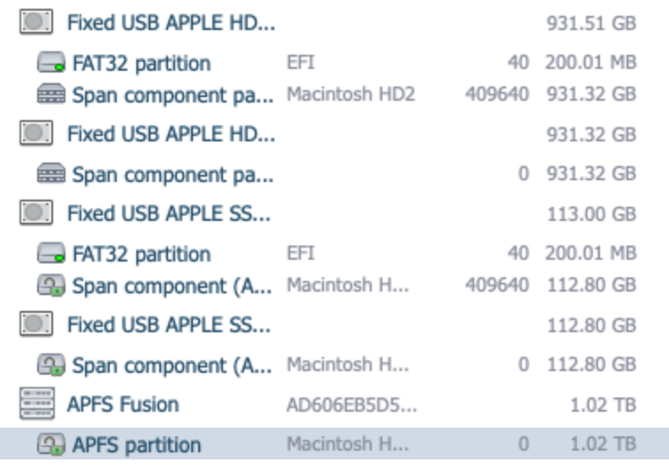
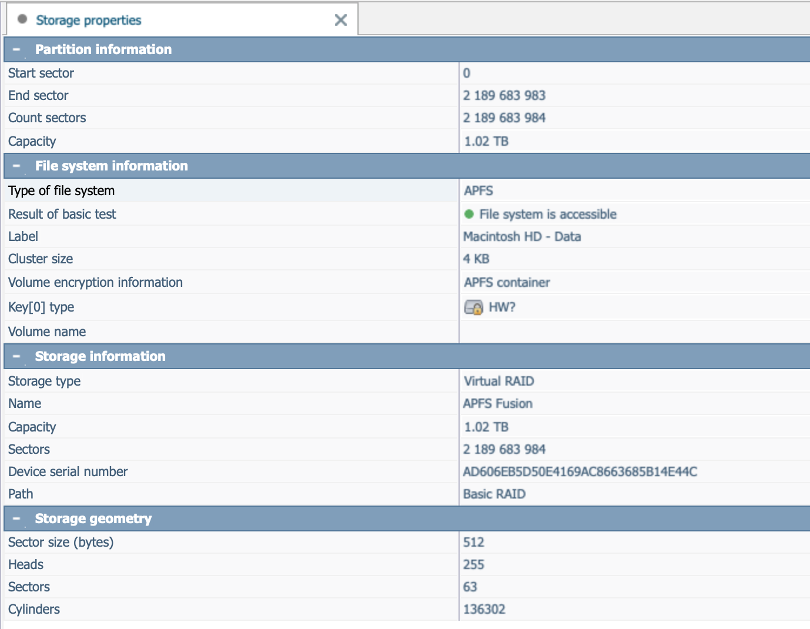

# Recover Apple Fusion Drive

I have been an Apple fan boy my entire life. Back in 2012 Apple introduced a new Storage Technology called Fusion Drive. It was a 1TB SSD with 1TB of HDD space. The SSD was used for the operating system and the HDD was used for the data. This seemed to solve the problem at the time in which SSDs were expensive and HDDs were slow. My Mac Mini (Late 2012) came with a Fusion Drive (1 TB HDD and 128 GB SSD). However, a few years back my Mac Mini died. Thankfully I had Time machien and I was able to get the data that I needed, however I left everything sitting on a shelf for a few years collecting dust. 

Today I decided I would take a look and see if I could get the Mac Mini running again, because I was looking for some old hardware to build out my HomeLab Kubernetes cluster. As I am working on the hardware I figured I would take a look at the disk. I hadn't even recalled that there were two disks in the box. I quickly saw one was SSD the other 1 TB HDD so I dug up my USB to dual drive IDE/SATA device from Insignia and figured I would be on my way to recovering the data. However, nothing came up, just two containers, so I started to dig and talked to ChatGPT and finally loaded up my Old copy of DiskDrill, and then I saw some old partions one was named Fusion Drive. Long story short this amazing concept that Apple came up with which was cutting edge at the time is now a relic of the past.

Thanks to ChatGPT it informed me of a couple of newer disk recover tools [UFS Explorer](https://www.ufsexplorer.com/) and [R-Studio](https://www.r-studio.com/data-recovery-software/). And I was able to find some great articles on the UFS site for my exact situation. 
- [How to Recover Data from a Fusion Drive](https://www.ufsexplorer.com/blog/how-to-recover-data-from-a-fusion-drive)
- [Data organization and recovery principles of Apple’s Fusion Drive](https://www.ufsexplorer.com/articles/storage-technologies/apple-fusion-drive)

Some additional articles I found
- [Mac HD, APFS, won’t mount but data is still there](https://www.reddit.com/r/datarecovery/comments/vy5w0t/mac_hd_apfs_wont_mount_but_data_is_still_there/)

This is what happened next.

## Install UFS Explorer

You will need to load some licensing software and then you can select to use a 60 day trial. One thing that seems amazing with this software is it appears to run on any OS. So I will likely be adding this to my Multi-Boot USB Drive as a core utility.

NOTE: Make sure to give it Full Disk Access in the System Preferences.

## Launch and Have it scan the disk

Amazingly it was able to find the Fusion Drive and once I enabled Full Disk Access any red flags were gone and I saw this.

NOTE: macOS 10.14 Mojave and later

In newer versions of macOS Apple delegated the responsibilities of Core Storage to the APFS file system. The procedure of data recovery from such a Fusion Drive can be performed using UFS Explorer RAID Recovery, UFS Explorer Network RAID or UFS Explorer Professional Recovery  and will look rather different:

## Restore the files that you can or at least need.

According to ChatGPT my best option now is to simply recover what I can/need from the drive if anything.

### 🧠 Why you can see it but not “fix” it

Your Fusion setup (from the Mac mini (Late 2012)) is:
- An **APFS Fusion container split across two disks**
- With **damaged or inconsistent container metadata**

#### UFS Explorer:
- Ignores broken metadata
- Rebuilds the structure in memory
- Lets you browse and copy files

#### macOS (Disk Utility / diskutil):
- Requires **perfect, consistent metadata**
- Will NOT mount if anything is off

#### 👉 That’s why:
- UFS works ✅
- macOS mounting fails ❌

### ⚠️ Can metadata be “restored”?

In theory: **yes**
In practice: **almost never worth it**

To truly restore it, you would need to:
- Rebuild APFS container superblocks
- Recreate Fusion pairing metadata
- Ensure block mapping consistency across both disks

👉 This is **low-level filesystem surgery**, and:
- Apple provides **no tools** for it
- UFS Explorer **does not write repaired metadata back**
- One mistake = permanent data loss

### 🚨 Why you should NOT try to “fix” it

Even if you found tools/scripts online:

- APFS Fusion is **poorly documented**
- Metadata is **mirrored and checksummed**
- Writing incorrect structures can:
  - Corrupt both disks
  - Destroy recoverable data

👉 You’re currently in a **recoverable state — don’t trade that for risk**

### ✅ The correct approach (industry standard)

When Fusion/APFS metadata is broken:

> **You do NOT repair the volume — you extract the data**

This is exactly what UFS Explorer is designed for.